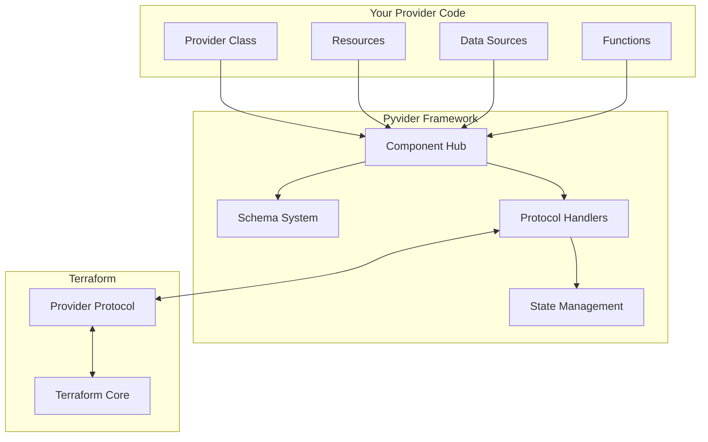

# 🐍 Pyvider: Build Terraform Providers in Pure Python

<p align="center">
    <a href="https://pypi.org/project/pyvider/">
        
    </a>
    <a href="https://github.com/provide-io/pyvider/actions/workflows/ci.yml">
        
    </a>
    <a href="https://codecov.io/gh/provide-io/pyvider">
        
    </a>
    <a href="https://github.com/provide-io/pyvider/blob/main/LICENSE">
        
    </a>
    <a href="https://www.python.org/downloads/">
        
    </a>
</p>

**Pyvider** is a Python framework for building Terraform providers. Write infrastructure providers using Python's elegance, type safety, and rich ecosystem while maintaining full compatibility with Terraform Plugin Protocol v6.

## ✨ Key Features

- **🐍 Pure Python** - Write providers using familiar Python patterns and libraries
- **🎯 Type-Safe** - Leverage type hints and attrs for robust code
- **🚀 Decorator-Based** - Simple registration system handles protocol complexity
- **📦 Protocol v6** - Full Terraform Plugin Protocol v6 implementation
- **⚡ Async** - Built on modern async/await for high performance
- **🧪 Testable** - Comprehensive testing with pytest integration

## 📦 Installation

Install Pyvider using your favorite package manager:

```bash
# Using pip
pip install pyvider

# Using uv (recommended for development)
uv add pyvider

# With all optional dependencies
pip install pyvider[all]
```

## 🚀 Quick Start

Create your first Terraform provider in under 5 minutes:

### 1. Define Your Provider

```python
# my_provider.py
from pyvider.providers import register_provider, BaseProvider, ProviderMetadata
from pyvider.resources import register_resource, BaseResource
from pyvider.schema import a_str
import attrs

@register_provider("mycloud")
class CloudProvider(BaseProvider):
    """Example cloud provider"""

    def __init__(self):
        super().__init__(
            metadata=ProviderMetadata(
                name="mycloud",
                version="1.0.0"
            )
        )

    @attrs.define
    class Config:
        api_key: str = a_str(
            required=True,
            sensitive=True,
            description="API key for authentication"
        )
        region: str = a_str(
            default="us-east-1",
            description="Default region"
        )

@register_resource("instance")
class Instance(BaseResource):
    """Cloud compute instance"""

    @attrs.define
    class Config:
        name: str = a_str(required=True)
        size: str = a_str(default="t2.micro")
        ami: str = a_str(required=True)

    @attrs.define
    class State:
        id: str = a_str(computed=True)
        public_ip: str = a_str(computed=True)
        status: str = a_str(computed=True)
    
    async def create(self, config: Config) -> State:
        # Your cloud API calls here
        return self.State(
            id=f"i-{config.name}",
            public_ip="203.0.113.42",
            status="running"
        )
    
    async def read(self, state: State) -> State | None:
        # Check if resource still exists
        return state
    
    async def update(self, config: Config, state: State) -> State:
        # Update the resource
        return state
    
    async def delete(self, state: State) -> None:
        # Clean up the resource
        pass
```

### 2. Use in Terraform

```hcl
terraform {
  required_providers {
    mycloud = {
      source = "example.com/mycompany/mycloud"
    }
  }
}

provider "mycloud" {
  api_key = var.api_key
  region  = "us-west-2"
}

resource "mycloud_instance" "web" {
  name = "web-server"
  size = "t3.large"
  ami  = "ami-12345678"
}

output "instance_ip" {
  value = mycloud_instance.web.public_ip
}
```

### 3. Test Your Provider

```python
# tests/test_instance.py
import pytest
from pyvider.resources.context import ResourceContext
from my_provider.resources import Instance

@pytest.mark.asyncio
async def test_instance_lifecycle():
    resource = Instance()

    # Create instance
    create_ctx = ResourceContext(
        config=Instance.Config(name="test-instance", ami="ami-12345"),
    )
    state, _ = await resource._create_apply(create_ctx)

    assert state
    assert state.status == "running"
    assert state.id.startswith("i-")

    # Update instance
    update_ctx = ResourceContext(
        config=Instance.Config(name="test-instance", ami="ami-12345", size="t3.xlarge"),
        state=state,
    )
    state, _ = await resource._update_apply(update_ctx)
    assert state.size == "t3.xlarge"

    # Destroy instance
    delete_ctx = ResourceContext(state=state)
    await resource._delete_apply(delete_ctx)
```

## 🏛️ Architecture

Pyvider implements a clean, layered architecture:



### Core Components

- **🎯 Component Hub**: Automatic discovery and registration via decorators
- **📋 Schema System**: Type-safe, validated data models with attrs
- **🔌 Protocol Layer**: Complete Terraform Plugin Protocol v6 implementation
- **💾 State Management**: Encrypted private state for sensitive data
- **🔄 Lifecycle Handlers**: Full CRUD operations with async support
- **🧩 Capabilities**: Extensible plugin system for reusable functionality

## 📚 Documentation

Full documentation is available at: [https://foundry.provide.io/pyvider/](https://foundry.provide.io/pyvider/)

### Quick Links
- [Installation Guide](docs/getting-started/installation.md)
- [Quick Start Tutorial](docs/getting-started/quick-start.md)
- [Architecture Overview](docs/core-concepts/architecture.md)
- [API Reference](docs/api/index.md)
- [Troubleshooting](docs/troubleshooting.md)

## 🎯 Use Cases

Pyvider excels at:

- **☁️ Cloud Infrastructure**: AWS, Azure, GCP providers with boto3, azure-sdk, etc.
- **🔧 Internal Tools**: Company-specific infrastructure and services
- **🔌 API Integrations**: RESTful services, GraphQL endpoints, webhooks
- **📊 Data Platforms**: Databases, data warehouses, streaming platforms
- **🤖 ML/AI Infrastructure**: Model deployments, training pipelines, notebooks
- **🔐 Security Tools**: Certificate management, secret rotation, compliance

## 🚦 Alpha Status

- **✅ Protocol Compliant**: Implements Terraform Plugin Protocol v6
- **🧪 Well Tested**: Growing test coverage with property-based testing
- **⚡ Async Throughout**: Built on modern async Python
- **🔒 Security First**: Built-in encryption for sensitive state data
- **📊 Observable**: Structured logging with provide.foundation
- **🌍 Cross-Platform**: Linux, macOS, Windows support

**Note**: Pyvider is in alpha. APIs may change before 1.0 release.

## 🤝 Contributing

We welcome contributions! See our [Contributing Guide](CONTRIBUTING.md) for details.

```bash
# Set up development environment
uv sync

# Run tests
pytest

# Check code quality
ruff check
mypy src/pyvider

# Build provider
python scripts/build_provider.py
```

## 📄 License

Apache 2.0 - See [LICENSE](LICENSE) for details.

## 🔗 Resources

- **Documentation**: [https://foundry.provide.io/pyvider/](https://foundry.provide.io/pyvider/)
- **Examples**: [pyvider-components](https://github.com/provide-io/pyvider-components)
- **PyPI**: [pyvider on PyPI](https://pypi.org/project/pyvider/)
- **GitHub**: [Source Code](https://github.com/provide-io/pyvider)
- **Support**: [GitHub Discussions](https://github.com/provide-io/pyvider/discussions)

## 🙏 Acknowledgments

Built with ❤️ by the team at [Provide](https://provide.io) using:
- [structlog](https://www.structlog.org/) for structured logging
- [attrs](https://www.attrs.org/) for classes done right
- [grpcio](https://grpc.io/) for protocol communication
- [cryptography](https://cryptography.io/) for state encryption

---

<p align="center">
  <strong>Ready to build your next Terraform provider in Python?</strong><br>
  <a href="docs/getting-started/quick-start.md">Get Started →</a>
</p>
