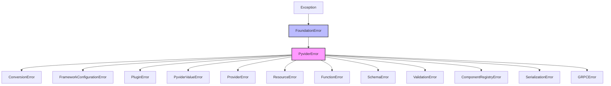

# Exceptions API Reference

This page documents Pyvider's exception hierarchy and error handling patterns for provider development.

## Exception Hierarchy



## Base Exceptions

!!! note "Foundation Error Hierarchy"
    All Pyvider exceptions inherit from `FoundationError` (from the `provide.foundation` library), which provides rich error context, automatic telemetry integration, and Terraform diagnostic generation support. You don't need to import or use `FoundationError` directly - use the Pyvider-specific exception classes below.

### `PyviderError`

Base exception for all Pyvider-specific errors. Inherits from `FoundationError`:

```python
from pyvider.exceptions import PyviderError

class PyviderError(FoundationError):
    """
    Base exception for all Pyvider errors.

    Attributes:
        message: Human-readable error message
        details: Additional error context (dict)
        cause: Original exception that caused this error
    """

    def __init__(
        self,
        message: str,
        details: dict | None = None,
        cause: Exception | None = None
    ):
        self.message = message
        self.details = details or {}
        self.cause = cause
        super().__init__(message)
```

## Provider Exceptions

### `ProviderError`

Errors related to provider configuration and lifecycle:

```python
from pyvider.exceptions import ProviderError

# Provider not configured
raise ProviderError("Provider not configured with credentials")

# Invalid configuration
raise ProviderError(
    "Invalid provider configuration",
    details={"field": "region", "value": "invalid-region"}
)

# Authentication failure
raise ProviderError(
    "Authentication failed",
    details={"endpoint": "https://api.example.com"},
    cause=original_exception
)
```

## Resource Exceptions

### `ResourceError`

Errors during resource lifecycle operations:

```python
from pyvider.exceptions import ResourceError

# Resource not found
raise ResourceError(
    "Resource not found",
    details={"resource_id": "i-12345", "type": "instance"}
)

# Creation failed
raise ResourceError(
    "Failed to create resource",
    details={"reason": "Quota exceeded", "limit": 10, "current": 10}
)

# Update conflict
raise ResourceError(
    "Resource was modified outside of Terraform",
    details={"expected_version": "1.2", "actual_version": "1.3"}
)

# Delete protection
raise ResourceError(
    "Cannot delete resource with deletion protection enabled",
    details={"resource_id": "db-prod-001", "protection": True}
)
```

## Function Exceptions

### `FunctionError`

Errors in provider function execution:

```python
from pyvider.exceptions import FunctionError

# Invalid input
raise FunctionError(
    "Invalid function input",
    details={"parameter": "algorithm", "value": "unsupported"}
)

# Execution failure
raise FunctionError(
    "Function execution failed",
    details={"function": "hash_file", "reason": "File too large"}
)
```

## Schema Exceptions

### `SchemaError`

Schema definition and validation errors:

```python
from pyvider.exceptions import SchemaError

# Invalid schema
raise SchemaError(
    "Invalid schema definition",
    details={"field": "port", "issue": "Missing required validator"}
)

# Type mismatch
raise SchemaError(
    "Schema type mismatch",
    details={"expected": "string", "got": "number", "field": "name"}
)
```

### `ValidationError`

Input validation failures:

```python
from pyvider.exceptions import ValidationError

# Required field missing
raise ValidationError(
    "Required field missing",
    details={"field": "api_key"}
)

# Invalid value
raise ValidationError(
    "Invalid field value",
    details={"field": "port", "value": 70000, "constraint": "1-65535"}
)

# Custom validation
raise ValidationError(
    "Custom validation failed",
    details={"field": "email", "reason": "Invalid email format"}
)
```

## Registry Exceptions

### `RegistryError`

Component registration errors:

```python
from pyvider.exceptions import RegistryError

# Duplicate registration
raise RegistryError(
    "Component already registered",
    details={"type": "resource", "name": "server"}
)

# Invalid component
raise RegistryError(
    "Invalid component class",
    details={"class": "MyResource", "reason": "Missing required methods"}
)
```

## Serialization Exceptions

### `SerializationError`

Data serialization/deserialization errors:

```python
from pyvider.exceptions import SerializationError

# Encoding error
raise SerializationError(
    "Failed to encode state",
    details={"type": "datetime", "value": "2024-01-01T00:00:00"},
    cause=original_exception
)

# Decoding error
raise SerializationError(
    "Failed to decode configuration",
    details={"data": raw_data, "expected_type": "dict"}
)
```

## gRPC Exceptions

### `GrpcError`

Protocol and communication errors:

```python
from pyvider.exceptions import GrpcError
import grpc

# Connection error
raise GrpcError(
    "Failed to connect to Terraform",
    details={"address": "localhost:50051"},
    cause=grpc_exception
)

# Protocol error
raise GrpcError(
    "Protocol version mismatch",
    details={"expected": "6", "got": "5"}
)
```

## Best Practices

### 1. Rich Error Context

Always provide detailed context:

```python
# Good - Rich context
raise ResourceError(
    "Failed to create S3 bucket",
    details={
        "bucket_name": config.bucket_name,
        "region": config.region,
        "error_code": "BucketAlreadyExists",
        "suggestion": "Choose a different bucket name"
    },
    cause=boto_exception
)

# Bad - Minimal context
raise ResourceError("Bucket creation failed")
```

### 2. Exception Chaining

Preserve the original exception:

```python
try:
    response = await api_client.create_resource(...)
except HttpError as e:
    # Preserve original exception
    raise ResourceError(
        f"API call failed: {e.status_code}",
        details={"endpoint": e.url, "method": "POST"},
        cause=e  # Original exception preserved
    )
```

### 3. Actionable Messages

Provide guidance when possible:

```python
raise ValidationError(
    "Invalid instance type for selected region",
    details={
        "instance_type": "t3.micro",
        "region": "us-gov-west-1",
        "valid_types": ["t2.micro", "t2.small"],
        "suggestion": "Use t2.micro for government regions"
    }
)
```

### 4. Structured Error Handling

```python
async def _create_apply(self, ctx: ResourceContext) -> tuple[State | None, None]:
    """Create resource with structured error handling."""
    try:
        # Validate inputs first
        self._validate_config(ctx.config)

        # Attempt creation
        result = await self._create_resource(ctx.config)

        # Validate result
        if not result.id:
            raise ResourceError(
                "Resource created but no ID returned",
                details={"response": result}
            )

        return self._build_state(result)

    except ValidationError:
        # Re-raise validation errors as-is
        raise

    except ClientError as e:
        # Map client errors to resource errors
        if e.code == "QUOTA_EXCEEDED":
            raise ResourceError(
                "Quota exceeded for resource type",
                details={
                    "type": config.resource_type,
                    "quota": e.quota,
                    "used": e.used
                },
                cause=e
            )
        elif e.code == "PERMISSION_DENIED":
            raise ProviderError(
                "Insufficient permissions",
                details={"required_permission": e.permission},
                cause=e
            )
        else:
            raise ResourceError(
                f"Unexpected error: {e.message}",
                cause=e
            )

    except Exception as e:
        # Catch-all for unexpected errors
        raise ResourceError(
            "Unexpected error during resource creation",
            details={"config": config.__dict__},
            cause=e
        )
```

## Custom Exceptions

Create domain-specific exceptions:

```python
from pyvider.exceptions import ResourceError

class QuotaExceededError(ResourceError):
    """Raised when a quota limit is exceeded."""

    def __init__(self, resource_type: str, limit: int, current: int):
        super().__init__(
            f"Quota exceeded for {resource_type}",
            details={
                "resource_type": resource_type,
                "limit": limit,
                "current": current,
                "available": limit - current
            }
        )

class ResourceLockedError(ResourceError):
    """Raised when a resource is locked and cannot be modified."""

    def __init__(self, resource_id: str, locked_by: str, locked_until: str):
        super().__init__(
            f"Resource {resource_id} is locked",
            details={
                "resource_id": resource_id,
                "locked_by": locked_by,
                "locked_until": locked_until
            }
        )
```

## Testing Exception Handling

```python
import pytest
from pyvider.exceptions import ResourceError, ValidationError
from pyvider.resources.context import ResourceContext

@pytest.mark.asyncio
async def test_resource_creation_error_handling(resource):
    """Test that errors are properly handled."""

    # Test validation error
    with pytest.raises(ValidationError) as exc_info:
        ctx = ResourceContext(config=Resource.Config(name=""))  # Empty name
        await resource._create_apply(ctx)

    assert "Required field" in str(exc_info.value)
    assert exc_info.value.details["field"] == "name"

    # Test resource error with cause
    with pytest.raises(ResourceError) as exc_info:
        ctx = ResourceContext(config=Resource.Config(name="test", invalid_field=True))
        await resource._create_apply(ctx)

    assert exc_info.value.cause is not None
    assert "invalid_field" in exc_info.value.details
```

## Logging Exceptions

```python
import structlog

logger = structlog.get_logger()

try:
    result = await operation()
except PyviderError as e:
    logger.error(
        "Operation failed",
        error_type=type(e).__name__,
        message=str(e),
        details=e.details,
        has_cause=e.cause is not None,
        exc_info=True  # Include traceback
    )
    raise
```

## Related Documentation

- [Error Handling Guide](../guides/development/error-handling.md) - Comprehensive error handling patterns
- [Logging](../guides/development/logging.md) - Structured logging with exceptions
- [Testing Providers](../guides/development/testing-providers.md) - Testing error scenarios

## Auto-Generated API Documentation
