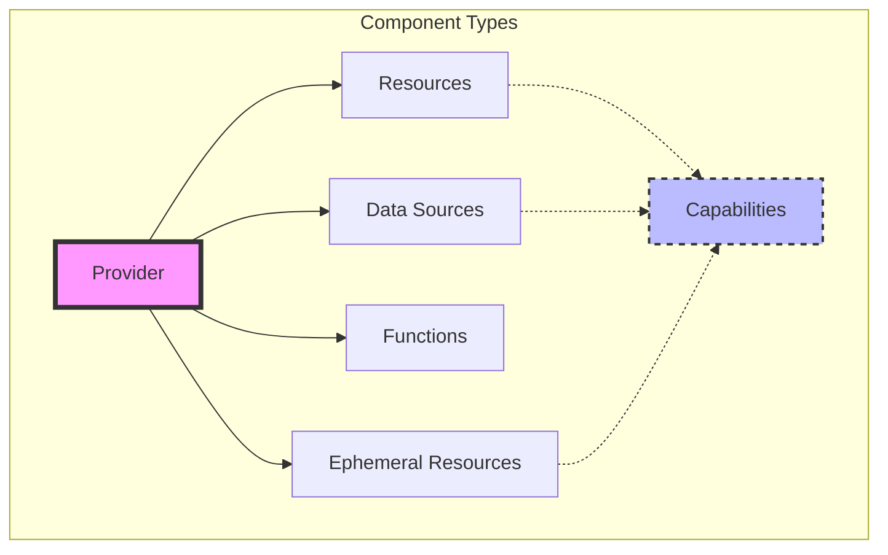
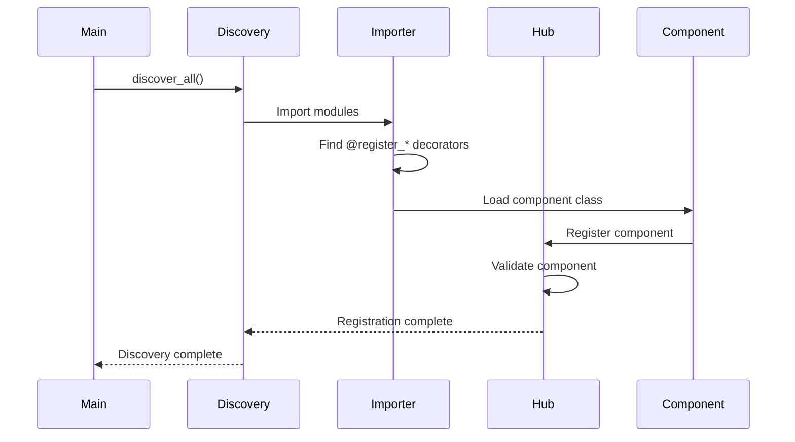
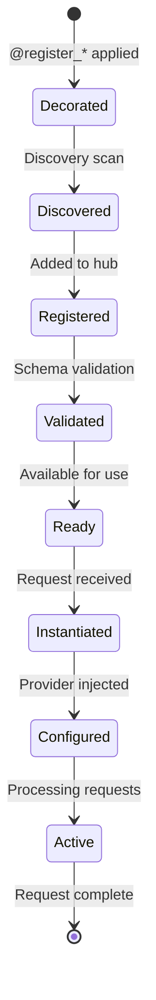

# 🧩 Component Model

Pyvider's component model provides a powerful, decorator-based system for building Terraform providers. This document explores how components are defined, discovered, registered, and managed throughout their lifecycle.

## 📊 Component Hierarchy



## 🎯 Component Types

### 1. Provider Component

The Provider is the root component that configures authentication and shared settings:

```python
from pyvider.providers import register_provider, BaseProvider, ProviderMetadata
import attrs

@register_provider("mycloud")
class MyCloudProvider(BaseProvider):
    """Root provider component for MyCloud services."""
    
    def __init__(self):
        super().__init__(
            metadata=ProviderMetadata(
                name="mycloud",
                version="1.0.0",
                protocol_version="6"
            )
        )
    
    @attrs.define
    class Config:
        """Provider configuration schema."""
        api_key: str = Attribute(
            required=True,
            sensitive=True,
            description="API key for authentication"
        )
        endpoint: str = Attribute(
            default="https://api.mycloud.com",
            description="API endpoint URL"
        )
        timeout: int = Attribute(
            default=30,
            description="Request timeout in seconds"
        )
    
    async def configure(self, config: Config) -> None:
        """Configure provider with validated configuration."""
        self.client = MyCloudClient(
            api_key=config.api_key,
            endpoint=config.endpoint,
            timeout=config.timeout
        )
        await self.client.authenticate()
```

**Key Characteristics:**
- **Singleton**: Only one provider instance per Terraform configuration
- **Configuration Hub**: Stores shared configuration for all resources
- **Authentication**: Manages API credentials and client initialization
- **Metadata**: Defines provider name, version, and capabilities

### 2. Resource Component

Resources represent manageable infrastructure with full CRUD lifecycle:

```python
from pyvider.resources import register_resource, BaseResource
from pyvider.schema import Attribute
import attrs

@register_resource("server")
class Server(BaseResource):
    """Manages a cloud server instance."""
    
    @attrs.define
    class Config:
        """Resource configuration (from Terraform)."""
        name: str = Attribute(required=True, description="Server name")
        size: str = Attribute(default="small", description="Instance size")
        image: str = Attribute(required=True, description="OS image")
        tags: dict[str, str] = Attribute(
            default_factory=dict,
            description="Resource tags"
        )
    
    @attrs.define
    class State:
        """Resource state (tracked by Terraform)."""
        id: str = Attribute(computed=True, description="Server ID")
        name: str = Attribute(description="Server name")
        size: str = Attribute(description="Instance size")
        image: str = Attribute(description="OS image")
        ip_address: str = Attribute(computed=True, description="Public IP")
        status: str = Attribute(computed=True, description="Server status")
        tags: dict[str, str] = Attribute(description="Resource tags")
    
    async def create(self, config: Config) -> State:
        """Create a new server."""
        server = await self.provider.client.create_server(
            name=config.name,
            size=config.size,
            image=config.image,
            tags=config.tags
        )
        return State(
            id=server.id,
            name=server.name,
            size=server.size,
            image=server.image,
            ip_address=server.public_ip,
            status=server.status,
            tags=server.tags
        )
    
    async def read(self, state: State) -> State | None:
        """Refresh server state."""
        try:
            server = await self.provider.client.get_server(state.id)
            return State(
                id=server.id,
                name=server.name,
                size=server.size,
                image=server.image,
                ip_address=server.public_ip,
                status=server.status,
                tags=server.tags
            )
        except NotFoundError:
            return None  # Server was deleted outside Terraform
    
    async def update(self, config: Config, state: State) -> State:
        """Update server configuration."""
        # Update mutable attributes
        if config.tags != state.tags:
            await self.provider.client.update_tags(state.id, config.tags)
        
        if config.size != state.size:
            await self.provider.client.resize_server(state.id, config.size)
        
        # Refresh and return new state
        return await self.read(state)
    
    async def delete(self, state: State) -> None:
        """Delete the server."""
        await self.provider.client.delete_server(state.id)
```

**Lifecycle Methods:**
- `create()`: Creates new infrastructure
- `read()`: Refreshes current state
- `update()`: Modifies existing infrastructure
- `delete()`: Removes infrastructure

### 3. Data Source Component

Data sources provide read-only access to existing infrastructure:

```python
from pyvider.data_sources import register_data_source, BaseDataSource
import attrs

@register_data_source("images")
class Images(BaseDataSource):
    """Fetches available server images."""
    
    @attrs.define
    class Config:
        """Data source configuration."""
        filter: str = Attribute(
            default="*",
            description="Image name filter pattern"
        )
        include_deprecated: bool = Attribute(
            default=False,
            description="Include deprecated images"
        )
    
    @attrs.define
    class State:
        """Data source output."""
        images: list[dict] = Attribute(
            computed=True,
            description="List of available images"
        )
        total_count: int = Attribute(
            computed=True,
            description="Total number of images"
        )
    
    async def read(self, config: Config) -> State:
        """Fetch image data."""
        images = await self.provider.client.list_images(
            filter=config.filter,
            include_deprecated=config.include_deprecated
        )
        
        return State(
            images=[
                {
                    "id": img.id,
                    "name": img.name,
                    "version": img.version,
                    "deprecated": img.deprecated
                }
                for img in images
            ],
            total_count=len(images)
        )
```

### 4. Function Component

Functions provide pure, callable transformations:

```python
from pyvider.functions import register_function, BaseFunction
import attrs
import hashlib

@register_function(name="hash_file")
class HashFile(BaseFunction):
    """Computes SHA256 hash of file content."""
    
    @attrs.define
    class Input:
        """Function input parameters."""
        content: str = Attribute(required=True, description="File content")
        algorithm: str = Attribute(
            default="sha256",
            description="Hash algorithm"
        )
    
    @attrs.define
    class Output:
        """Function output."""
        hash: str = Attribute(description="Computed hash")
        algorithm: str = Attribute(description="Algorithm used")
    
    async def call(self, input: Input) -> Output:
        """Execute the function."""
        if input.algorithm == "sha256":
            hash_obj = hashlib.sha256(input.content.encode())
        elif input.algorithm == "md5":
            hash_obj = hashlib.md5(input.content.encode())
        else:
            raise ValueError(f"Unsupported algorithm: {input.algorithm}")
        
        return Output(
            hash=hash_obj.hexdigest(),
            algorithm=input.algorithm
        )
```

### 5. Ephemeral Resource Component

Ephemeral resources manage short-lived connections or sessions:

```python
from pyvider.ephemerals import register_ephemeral_resource, BaseEphemeral
import attrs

@register_ephemeral_resource("database_connection")
class DatabaseConnection(BaseEphemeral):
    """Manages a temporary database connection."""
    
    @attrs.define
    class Config:
        """Connection configuration."""
        host: str = Attribute(required=True)
        port: int = Attribute(default=5432)
        database: str = Attribute(required=True)
        username: str = Attribute(required=True)
        password: str = Attribute(required=True, sensitive=True)
    
    @attrs.define
    class State:
        """Connection state."""
        connection_id: str = Attribute(computed=True)
        connected_at: str = Attribute(computed=True)
        expires_at: str = Attribute(computed=True)
    
    async def open(self, config: Config) -> State:
        """Open a new connection."""
        conn = await self.provider.db_pool.connect(
            host=config.host,
            port=config.port,
            database=config.database,
            username=config.username,
            password=config.password
        )
        
        return State(
            connection_id=conn.id,
            connected_at=conn.created_at.isoformat(),
            expires_at=conn.expires_at.isoformat()
        )
    
    async def renew(self, state: State) -> State:
        """Renew the connection lease."""
        conn = await self.provider.db_pool.renew(state.connection_id)
        return State(
            connection_id=conn.id,
            connected_at=state.connected_at,
            expires_at=conn.expires_at.isoformat()
        )
    
    async def close(self, state: State) -> None:
        """Close the connection."""
        await self.provider.db_pool.disconnect(state.connection_id)
```

## 🔍 Component Discovery

### Automatic Discovery Process



### Entry Points

Components can be discovered through Python entry points:

```toml
# pyproject.toml
[project.entry-points."pyvider.components"]
mycloud = "mycloud_provider.components"
```

### Manual Registration

For testing or dynamic components:

```python
from pyvider.hub import hub

# Manual registration
hub.register("resource", "custom_resource", CustomResource)

# Verify registration
assert "custom_resource" in hub.resources
```

## 🎨 Decorator System

### Registration Decorators

Each component type has its own registration decorator:

```python
# Provider
@register_provider("name")
class MyProvider(BaseProvider): ...

# Resource
@register_resource("name")
class MyResource(BaseResource): ...

# Data Source
@register_data_source("name")
class MyDataSource(BaseDataSource): ...

# Function
@register_function(name="name")
class MyFunction(BaseFunction): ...

# Ephemeral
@register_ephemeral_resource("name")
class MyEphemeral(BaseEphemeral): ...
```

### Decorator Metadata

Decorators attach metadata for discovery:

```python
@register_resource("server")
class Server(BaseResource):
    pass

# Attached metadata:
# Server._is_registered_resource = True
# Server._registered_name = "server"
```

## 🔗 Component Relationships

### Provider-Resource Relationship

```python
@register_resource("server")
class Server(BaseResource):
    async def create(self, config: Config) -> State:
        # Access provider instance
        client = self.provider.client
        
        # Use provider configuration
        region = self.provider.config.region
        
        # Call provider methods
        server = await client.create_server(...)
        return State(...)
```

### Capability Composition

Components can be enhanced with capabilities:

```python
from pyvider.capabilities import register_capability

@register_capability("taggable")
class TaggableCapability:
    """Adds tagging functionality to resources."""
    
    def apply_tags(self, resource_id: str, tags: dict[str, str]):
        # Tag management logic
        pass

@register_resource("server", capabilities=["taggable"])
class Server(BaseResource):
    async def create(self, config: Config) -> State:
        # Create server
        server = await self.provider.client.create_server(...)
        
        # Use capability
        self.capabilities.taggable.apply_tags(server.id, config.tags)
        
        return State(...)
```

## 📋 Schema Generation

### Automatic Schema Discovery

Pyvider automatically generates Terraform schemas from Python classes:

```python
@attrs.define
class Config:
    name: str = Attribute(required=True)
    size: int = Attribute(default=10, validators=[Range(1, 100)])
    tags: dict[str, str] = Attribute(default_factory=dict)

# Generated Terraform schema:
{
    "name": {
        "type": "string",
        "required": true
    },
    "size": {
        "type": "number",
        "optional": true,
        "default": 10,
        "validators": [{
            "type": "range",
            "min": 1,
            "max": 100
        }]
    },
    "tags": {
        "type": "map",
        "element_type": "string",
        "optional": true
    }
}
```

### Type Mappings

| Python Type | Terraform Type | Example |
|-------------|----------------|---------|
| `str` | `string` | `"hello"` |
| `int` | `number` | `42` |
| `float` | `number` | `3.14` |
| `bool` | `bool` | `true` |
| `list[T]` | `list(T)` | `["a", "b"]` |
| `dict[str, T]` | `map(T)` | `{"key": "value"}` |
| `set[T]` | `set(T)` | `["unique"]` |
| `@attrs.define` | `object` | Complex nested object |

## 🔄 Component Lifecycle

### Initialization Flow



### Resource Instance Lifecycle

```python
# 1. Instantiation (per request)
resource = hub.get_resource("server")()

# 2. Provider injection
resource.provider = configured_provider

# 3. Context injection (if needed)
resource.context = ResourceContext(
    resource_type="mycloud_server",
    resource_name="web_server"
)

# 4. Method invocation
state = await resource.create(config)

# 5. Cleanup (automatic)
# Instance is garbage collected after request
```

## 🛡️ Validation

### Component Validation

Components are validated during registration:

```python
def validate_resource(cls: type) -> None:
    """Validate resource component."""
    # Check base class
    if not issubclass(cls, BaseResource):
        raise ValidationError("Must inherit from BaseResource")
    
    # Check required methods
    required = ['create', 'read', 'update', 'delete']
    for method in required:
        if not hasattr(cls, method):
            raise ValidationError(f"Missing required method: {method}")
    
    # Check schema classes
    if not hasattr(cls, 'Config'):
        raise ValidationError("Missing Config class")
    if not hasattr(cls, 'State'):
        raise ValidationError("Missing State class")
```

### Schema Validation

```python
@attrs.define
class Config:
    port: int = Attribute(
        required=True,
        validators=[
            Range(min=1, max=65535),
            lambda x: x != 22 or ValueError("SSH port not allowed")
        ]
    )
```

## 🎯 Best Practices

### 1. Component Design

**Do:**
- Keep components focused on a single responsibility
- Use descriptive names that match Terraform conventions
- Implement comprehensive error handling
- Document all attributes and methods

**Don't:**
- Mix concerns in a single component
- Use generic names like "Resource" or "Data"
- Ignore error cases
- Skip validation

### 2. Schema Design

```python
@attrs.define
class Config:
    # Good: Clear, typed, documented
    instance_type: str = Attribute(
        required=True,
        description="EC2 instance type (e.g., t3.micro)",
        validators=[OneOf(["t3.micro", "t3.small", "t3.medium"])]
    )
    
    # Bad: Vague, untyped, no validation
    config: dict = Attribute()  # Too generic!
```

### 3. State Management

```python
class State:
    # Include only essential state
    id: str = Attribute(computed=True)  # Always include ID
    name: str = Attribute()  # User-provided values
    
    # Computed values that might change
    status: str = Attribute(computed=True)
    ip_address: str = Attribute(computed=True)
    
    # Don't include:
    # - Temporary values
    # - Values that can be recomputed
    # - Large data blobs
```

### 4. Error Handling

```python
async def create(self, config: Config) -> State:
    try:
        result = await self.provider.client.create(...)
    except ClientError as e:
        if e.code == "QUOTA_EXCEEDED":
            raise ResourceError(
                "Quota exceeded for this resource type",
                details={"limit": e.limit, "current": e.current}
            )
        raise ResourceError(f"Failed to create resource: {e}")
    
    return State(...)
```

## 📚 Advanced Topics

### Dynamic Component Registration

```python
# Register components at runtime
def create_dynamic_resource(table_name: str):
    @register_resource(f"dynamodb_{table_name}")
    class DynamicTable(BaseResource):
        # Implementation
        pass
    
    return DynamicTable

# Create and register
UserTable = create_dynamic_resource("users")
```

### Component Inheritance

```python
class BaseCloudResource(BaseResource):
    """Shared functionality for cloud resources."""
    
    async def apply_common_tags(self, resource_id: str):
        # Common tagging logic
        pass

@register_resource("server")
class Server(BaseCloudResource):
    # Inherits common functionality
    pass
```

### Testing Components

```python
import pytest
from pyvider.testing import ComponentTestCase

class TestServer(ComponentTestCase):
    component_class = Server
    
    async def test_create(self):
        config = Server.Config(name="test", size="small")
        state = await self.component.create(config)
        
        assert state.id is not None
        assert state.name == "test"
        assert state.status == "running"
```

## 🔗 Related Documentation

- [Architecture Overview](architecture.md) - System architecture
- [Schema System](schema-system.md) - Schema definition and validation
- [Creating Providers](../guides/creating-providers.md) - Provider development guide
- [Building Resources](../guides/building-resources.md) - Resource implementation guide

---

<p align="center">
  Continue to <a href="schema-system.md">Schema System →</a>
</p>