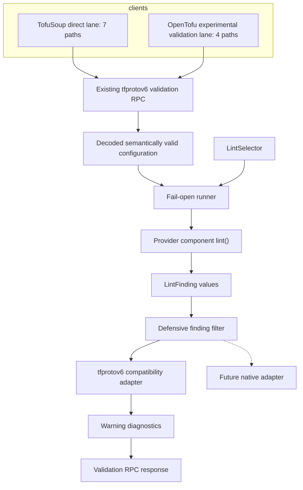

# Provider linting

Pyvider providers can report opt-in configuration advice through a supported,
protocol-neutral author API.

`LintFinding`, `LintSelector`, and `LintContext` are supported public APIs:

- `LintFinding` is an immutable rule result with its rule ID, groups, summary,
  detail, and optional top-level attribute path.
- `LintSelector` parses and evaluates the active rule selectors.
- `LintContext[ConfigT]` provides decoded configuration plus an `enabled()`
  shortcut for avoiding work when a rule cannot be selected.

## Authoring a rule

Implement the asynchronous `lint()` hook on any configuration-bearing
component. The context carries the decoded configuration and selection state;
return immutable findings rather than protocol diagnostics.

```python
from collections.abc import Sequence

from pyvider.lint import LintContext, LintFinding

async def lint(self, ctx: LintContext[HTTPAPIConfig]) -> Sequence[LintFinding]:
    rule = "example/acme:insecure-http"
    groups = ("example/acme:all", "example/acme:security")
    if not ctx.enabled(rule, *groups) or not ctx.config.url.startswith("http://"):
        return ()
    return (LintFinding(rule, groups, "Insecure HTTP endpoint",
            "Use HTTPS or suppress this rule when plaintext is intentional.", "url"),)
```

### Rule-writing guidance

Keep rules deterministic and side-effect free: inspect the decoded value, but
do not read files, contact services, or mutate configuration or external state.
Call `ctx.enabled(rule, *groups)` before any expensive work. Although linting
runs after semantic validation succeeds, rules must remain unknown-safe. For an
omitted value, `None`, a framework unknown, an unparsable representation, or a
value whose comparison raises, emit no finding. Emit only when the triggering
value is known.

Use stable fully qualified rule IDs and stable provider-owned groups. Make the
summary concise, explain the concern and remediation in `detail`, and set
`attribute_path` only to a real top-level configured attribute.

## Choose the right signal

These mechanisms have different contracts:

| Signal | Use it when |
| --- | --- |
| Validation error | The configuration is invalid and processing must stop. |
| Deprecation | A supported feature is being retired and users need migration guidance. |
| Ordinary warning | The provider has non-selectable operational information unrelated to a lint rule. |
| Lint finding | Valid configuration may be risky, surprising, or worth reviewing; the advice is opt-in and selectable by rule or group. |

Do not weaken validation into a lint, turn a deprecation into optional advice, or
use a lint for routine runtime warnings.

## Failure behavior

Lint execution is fail-open. If an enabled hook raises or returns invalid
finding metadata, valid configuration remains valid and existing validation
diagnostics remain intact. Pyvider logs safe component context without the
configuration or exception details that could contain secrets, and returns one
ordinary, non-blocking warning titled `Provider linting did not complete`.
The compatibility adapter also revalidates findings and keeps protobuf encoding
inside this boundary, so malformed text cannot escape as an RPC exception or be
converted into a validation error. That generic warning is emitted only when
provider linting was requested.

## Enabling and selecting rules

Provider linting is disabled unless selectors are configured. To persist a
selection in `pyvider.toml`, set `[lint].rules`:

```toml
[lint]
rules = ["example/acme:all", "!example/acme:insecure-http"]
```

For a single process, `PYVIDER_LINT` accepts a comma-separated list and
completely overrides the file:

```shell
PYVIDER_LINT='example/acme:security,!example/acme:insecure-http' tofu validate
```

Presence matters: an explicitly empty value overrides the file and disables
all provider rules for that process.

```shell
PYVIDER_LINT='' tofu validate
```

The configuration precedence is:

```text
PYVIDER_LINT > [lint].rules > disabled
```

### Selector grammar and matching

Pyvider follows the lint-address grammar in the pinned OpenTofu RFC:

```text
^([a-z0-9]+[a-z0-9_\-/]*:)?[a-z0-9]+[a-z0-9_\-]*$
```

Selectors are trimmed and de-duplicated. A single leading `!` marks an
exclusion. Malformed entries are logged and ignored; syntactically valid but
unknown selectors are silent no-ops. If the same identifier is included and
excluded at the same level, Pyvider logs the conflict and inclusion wins.

For a finding's primary rule and groups, matching uses OpenTofu's precedence:

1. Exact rule inclusion enables the finding.
2. Exact rule exclusion disables it.
3. Any included group enables it.
4. Any excluded group disables it.
5. Global `all` enables it.
6. Otherwise the finding is disabled.

A namespaced `example/acme:all` is a provider-defined group, not the global
`all` selector.

## OpenTofu transport status (2026-09-22)

Pyvider's author-facing API is supported. Separately, OpenTofu's built-in
linter remains experimental under OpenTofu's own status designation.

As of 2026-09-22, the tested OpenTofu version is `v1.13.0-rc1`. The
checksum-verified casts and proof manifest published with
[terraform-provider-pyvider 0.6.0](https://github.com/provide-io/terraform-provider-pyvider/releases/tag/v0.6.0)
record that exact version. Proofs through provider 0.5.0 were pinned to
`v1.13.0-beta1`.



The recorded TofuSoup proof exercises the direct lane through all seven
configuration-bearing paths: provider, resource, data source, ephemeral, list,
action, and state store. The OpenTofu experimental validation lane reaches the four
paths in this fixture: provider, resource, data source, and ephemeral. Neither
client supplied provider selector hints over tfprotov6 in that proof; Pyvider
obtained the selection from its provider-side configuration instead.

As implemented here, tfprotov6 has no provider-lint wire message and cannot
carry provider selection hints from OpenTofu's `-lint` flag. Pyvider therefore
does not invent protocol fields. `-lint` selects OpenTofu core rules only, while
a provider's rules are selected through `[lint].rules` or `PYVIDER_LINT`. To
run both layers explicitly:

```shell
PYVIDER_LINT=example/acme:all tofu validate -lint=all
```

Until a native protocol exists, Pyvider maps each selected finding to an
ordinary warning diagnostic. This temporary compatibility bridge appends the
rule ID to the summary, preserves the detail and optional top-level attribute
path, and keeps groups internal because the wire format has nowhere to carry
them. Components remain protocol-neutral and never construct protobuf
diagnostics themselves.

## Native protocol migration

When OpenTofu publishes provider lint protocol support, Pyvider will add a
native transport and capability negotiation, populate selection from official
hints when available, and apply explicit file or environment selection only as
provider-side policy. A response will contain native lint messages or
compatibility warnings, never both. The compatibility encoder can then be
retired once supported OpenTofu versions no longer need it.

This is a transport-only migration: component `lint()` hooks, rule IDs, groups,
and unrelated author examples will not change. The same model, selection,
component, and packaged-provider contracts will exercise the native adapter.

## OpenTofu sources

- [Built-in linter RFC at the v1.13.0-beta1 commit](https://github.com/opentofu/opentofu/blob/cfe442d449412bcc76e9d36f4a0cef19483c3eb2/rfc/20260406-linting.md)
- [Linting implementation tracker](https://github.com/opentofu/opentofu/issues/4310)
- [Initial implementation commit](https://github.com/opentofu/opentofu/commit/a35a77b22e54266c6e72249a3ec54f396dd0356a)
- [OpenTofu v1.13.0-beta1](https://github.com/opentofu/opentofu/releases/tag/v1.13.0-beta1)
- [OpenTofu v1.13.0-rc1](https://github.com/opentofu/opentofu/releases/tag/v1.13.0-rc1)
