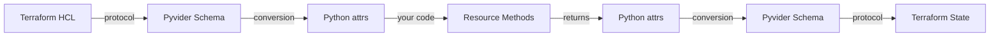

# Schema System

The Pyvider schema system is the bridge between Python and Terraform's type systems. It provides a declarative way to define the structure and constraints of your provider's resources, data sources, and functions.

## Why Schemas Matter

Schemas serve multiple purposes in Pyvider:

- **Type Safety**: Define what data flows between Terraform and your provider
- **Validation**: Ensure user inputs meet requirements before execution
- **Documentation**: Descriptions appear in Terraform documentation
- **Terraform Integration**: Automatically translated to Terraform's protocol format

## Quick Example

Here's how schemas work in practice:

```python
from pyvider.schema import s_resource, a_str, a_num, a_bool

@register_resource("server")
class Server(BaseResource):
    @classmethod
    def get_schema(cls):
        return s_resource({
            # User inputs
            "name": a_str(required=True, description="Server name"),
            "port": a_num(default=8080, description="Port number"),

            # Provider outputs
            "id": a_str(computed=True, description="Unique ID"),
            "ip_address": a_str(computed=True, description="Assigned IP"),
        })
```

This schema tells Terraform:
- Users must provide a `name` (string, required)
- `port` is optional with a default of 8080
- `id` and `ip_address` are computed by the provider

## Schema Factories

Pyvider uses **factory functions** to build schemas:

```python
from pyvider.schema import (
    s_resource, s_data_source, s_provider,  # Schema builders
    a_str, a_num, a_bool, a_list, a_map,   # Attribute types
    b_list, b_single,                       # Nested blocks
)
```

These factories create type-safe schema definitions that Pyvider automatically converts to Terraform's protocol format.

## Key Concepts

### Attributes vs Blocks

- **Attributes**: Simple or collection values (`a_str()`, `a_num()`, `a_list()`)
- **Blocks**: Nested configuration structures (`b_list()`, `b_single()`)

### Required, Optional, and Computed

```python
{
    "name": a_str(required=True),      # User must provide
    "port": a_num(default=8080),       # User can override default
    "id": a_str(computed=True),        # Provider calculates
}
```

### Type Mapping

Pyvider automatically maps Python types to Terraform types:

| Python | Terraform | Factory |
|--------|-----------|---------|
| `str` | `string` | `a_str()` |
| `int`, `float` | `number` | `a_num()` |
| `bool` | `bool` | `a_bool()` |
| `list[T]` | `list(T)` | `a_list(T)` |
| `dict[str, T]` | `map(T)` | `a_map(T)` |

## How It Works

When you define a schema:

1. **Build Time**: Factory functions create a schema structure
2. **Startup**: Pyvider converts schemas to Terraform protocol format
3. **Runtime**: Data flows between Terraform ↔ Python via automatic conversion
4. **Type Safety**: Your `@attrs.define` classes get properly typed data



## Best Practices

1. **Always add descriptions** - They appear in Terraform docs
2. **Use appropriate defaults** - Make common cases easy
3. **Mark sensitive data** - Use `sensitive=True` for passwords, tokens
4. **Validate inputs** - Add validators to catch errors early
5. **Keep schemas simple** - Prefer flat structures when possible

## Complete Schema Reference

This overview introduces the core concepts. For comprehensive documentation including:

- **Detailed attribute reference** - All available types and modifiers
- **Nested blocks** - Complex configuration structures
- **Validators** - Input validation techniques
- **Advanced patterns** - Schema composition and reuse
- **Examples** - Real-world schema definitions

See the **[Complete Schema Documentation →](../schema/overview.md)**

---

<p align="center">
  Continue to <a href="../guides/creating-providers.md">Creating Providers →</a>
</p>
