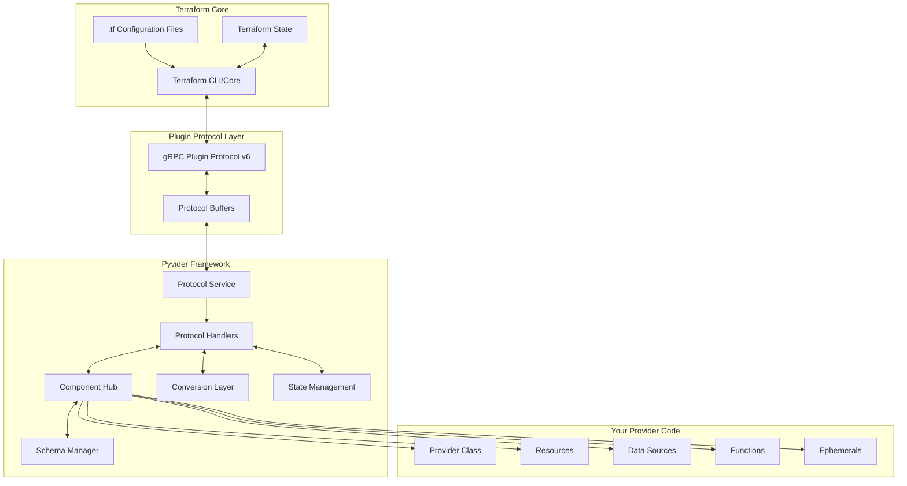
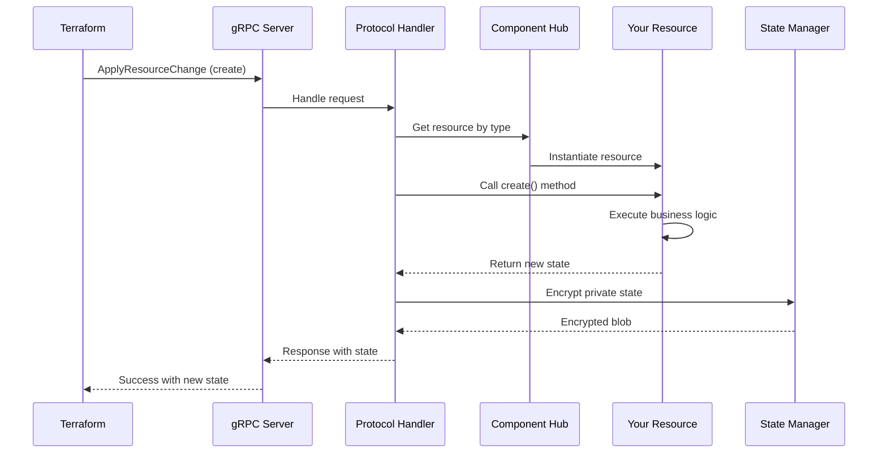
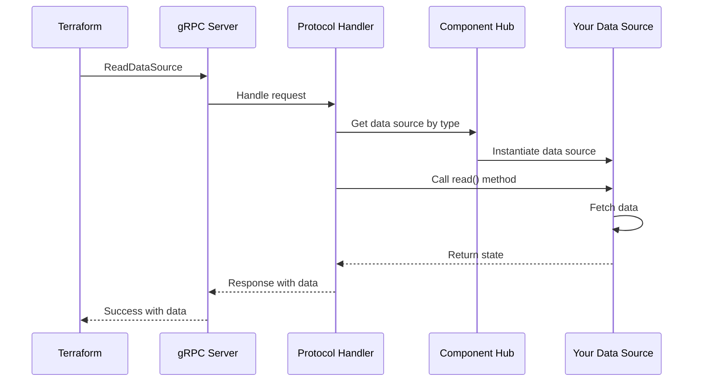
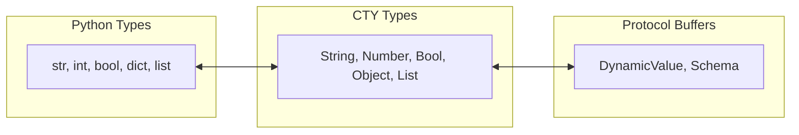
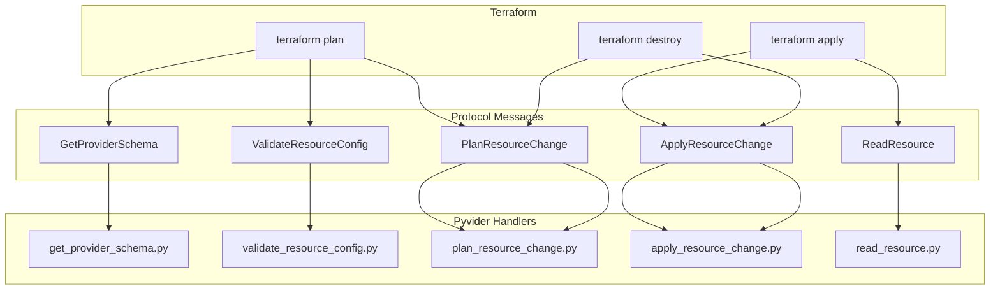
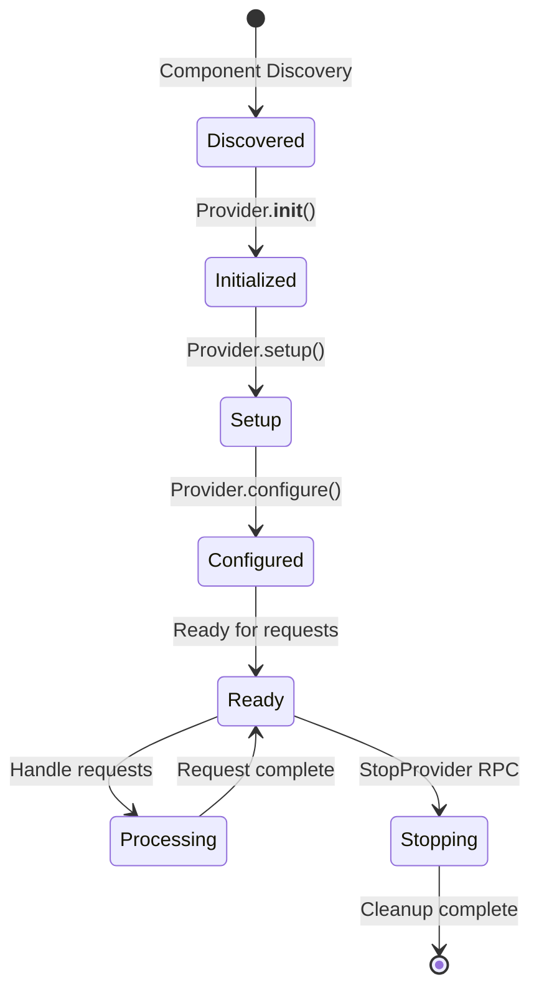
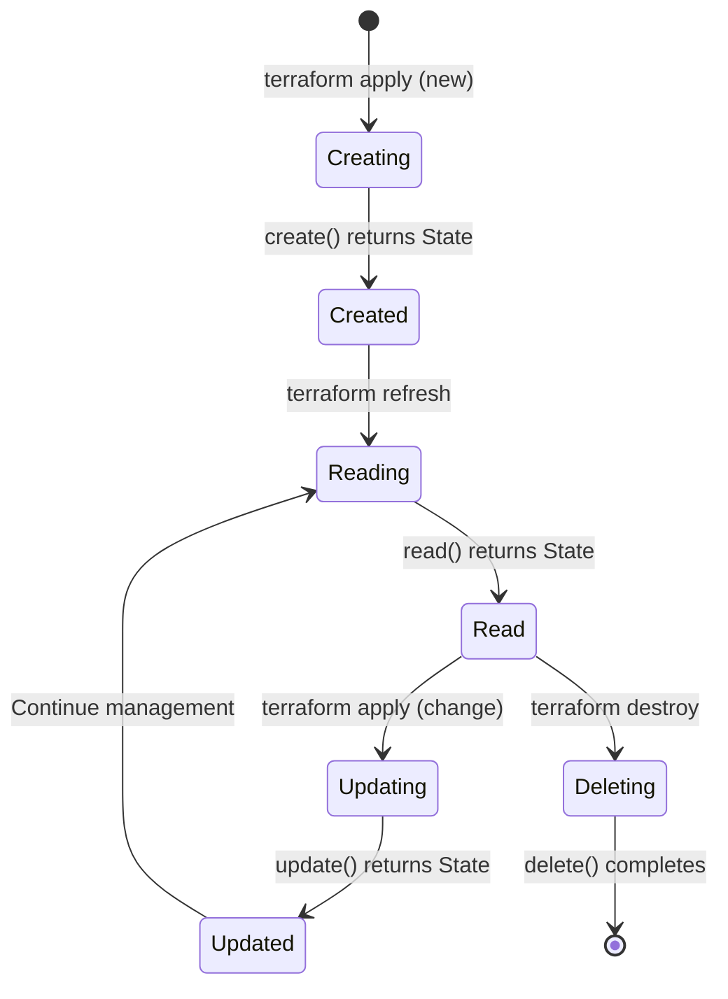

# 🏛️ Architecture Overview

Pyvider implements a sophisticated, layered architecture that seamlessly bridges Python code with Terraform's Plugin Protocol v6. This document provides a comprehensive understanding of how Pyvider transforms your Python classes into fully functional Terraform providers.

## 📊 High-Level Architecture



## 🔄 Request Flow

Understanding how a request flows through Pyvider is crucial for debugging and optimization:

### 1. Resource Creation Flow



### 2. Data Source Read Flow



## 🧩 Core Components

### 1. Component Hub (`pyvider.hub`)

The Component Hub is the central registry that manages all provider components:

```python
# Internal structure
class ComponentHub:
    providers: dict[str, type[BaseProvider]]
    resources: dict[str, type[BaseResource]]
    data_sources: dict[str, type[BaseDataSource]]
    functions: dict[str, type[BaseFunction]]
    ephemerals: dict[str, type[BaseEphemeral]]
```

**Responsibilities:**
- Automatic component discovery via decorators
- Type validation and registration
- Dependency injection for capabilities
- Component lifecycle management

### 2. Protocol Service (`pyvider.protocols.service`)

The Protocol Service implements the Terraform Plugin Protocol v6 gRPC service:

```python
class TerraformProviderServicer:
    async def GetProviderSchema(...)
    async def ValidateProviderConfig(...)
    async def ConfigureProvider(...)
    async def ValidateResourceConfig(...)
    async def PlanResourceChange(...)
    async def ApplyResourceChange(...)
    async def ReadResource(...)
    async def ImportResourceState(...)
    # ... and more
```

**Key Features:**
- Full Protocol v6 implementation
- Async/await support throughout
- Automatic error handling and diagnostics
- Request/response logging for debugging

### 3. Schema System (`pyvider.schema`)

The Schema System provides type-safe data modeling:

```python
from pyvider.schema import s_resource, a_str, a_map, a_num

@attrs.define
class ResourceConfig:
    """Configuration attrs class"""
    name: str
    tags: dict[str, str]
    size: int

@register_resource("example")
class ExampleResource(BaseResource):
    config_class = ResourceConfig

    @classmethod
    def get_schema(cls):
        """Schema definition using factory functions"""
        return s_resource({
            "name": a_str(required=True, description="Resource name"),
            "tags": a_map(a_str(), default={}, description="Resource tags"),
            "size": a_num(
                validators=[lambda x: 1 <= x <= 100 or "Must be 1-100"],
                description="Resource size"
            ),
        })
```

**Features:**
- Automatic schema generation from Python types
- Built-in validators and constraints
- Computed and sensitive attribute support
- Nested blocks and complex types

### 4. Conversion Layer (`pyvider.conversion`)

Handles bidirectional conversion between Python and Terraform types:



**Conversion Examples:**
- Python `dict` ↔ CTY `Object` ↔ Protocol Buffer `DynamicValue`
- Python `list[str]` ↔ CTY `List(String)` ↔ Protocol Buffer `DynamicValue`
- Python `@attrs.define` class ↔ CTY `Object` with schema

### 5. State Management (`pyvider.resources.private_state`)

Manages resource state with encryption for sensitive data:

```python
class PrivateState:
    """Encrypted storage for sensitive provider data"""
    
    @classmethod
    def encrypt(cls, data: dict) -> bytes:
        # AES-256 encryption with key derivation
        
    @classmethod
    def decrypt(cls, encrypted: bytes) -> dict:
        # Secure decryption with validation
```

**Security Features:**
- AES-256-GCM encryption
- Key derivation with PBKDF2
- Automatic key rotation support
- Tamper detection

## 🔌 Protocol Implementation

### Terraform Plugin Protocol v6

Pyvider implements the complete Terraform Plugin Protocol v6 specification:

#### Supported RPCs

| RPC Method | Purpose | Pyvider Support |
|------------|---------|-----------------|
| `GetProviderSchema` | Returns provider schema | ✅ Full |
| `ValidateProviderConfig` | Validates provider config | ✅ Full |
| `ConfigureProvider` | Configures provider instance | ✅ Full |
| `ValidateResourceConfig` | Validates resource config | ✅ Full |
| `ValidateDataResourceConfig` | Validates data source config | ✅ Full |
| `UpgradeResourceState` | Migrates resource state | ✅ Full |
| `ReadResource` | Refreshes resource state | ✅ Full |
| `PlanResourceChange` | Plans resource changes | ✅ Full |
| `ApplyResourceChange` | Applies resource changes | ✅ Full |
| `ImportResourceState` | Imports existing resources | ✅ Full |
| `MoveResourceState` | Moves resources | ✅ Full |
| `ReadDataSource` | Reads data source | ✅ Full |
| `GetFunctions` | Returns function definitions | ✅ Full |
| `CallFunction` | Executes functions | ✅ Full |
| `OpenEphemeralResource` | Opens ephemeral resource | ✅ Full |
| `RenewEphemeralResource` | Renews ephemeral resource | ✅ Full |
| `CloseEphemeralResource` | Closes ephemeral resource | ✅ Full |
| `StopProvider` | Graceful shutdown | ✅ Full |

### Message Flow



## 🎯 Component Discovery

Pyvider uses a sophisticated discovery mechanism to find and register components:

### Discovery Process

1. **Entry Point Scanning**: Looks for `pyvider.components` entry points
2. **Package Traversal**: Recursively scans packages for decorated classes
3. **Decorator Detection**: Identifies classes with registration decorators
4. **Validation**: Ensures components meet interface requirements
5. **Registration**: Adds valid components to the hub

### Registration Flow

```python
# Your code
@register_resource("my_resource")
class MyResource(BaseResource):
    pass

# Discovery process
1. Scanner finds @register_resource decorator
2. Validates MyResource extends BaseResource
3. Checks for required methods (create, read, update, delete)
4. Registers in hub.resources["my_resource"] = MyResource
5. Generates Terraform schema from class definition
```

## 🔧 Lifecycle Hooks

Pyvider provides lifecycle hooks for advanced customization:

### Provider Lifecycle



### Resource Lifecycle



## ⚡ Performance Optimizations

### 1. Async Everything

All I/O operations use async/await for maximum concurrency:

```python
async def _create_apply(self, ctx: ResourceContext) -> tuple[State | None, None]:
    # Parallel API calls
    results = await asyncio.gather(
        self.create_network(),
        self.allocate_storage(),
        self.configure_security()
    )
    return State(...), None
```

### 2. Connection Pooling

gRPC connections are pooled and reused:

```python
# Automatic connection management
channel_pool = grpc.aio.insecure_channel(
    target='localhost:50051',
    options=[
        ('grpc.max_connection_idle_ms', 30000),
        ('grpc.keepalive_time_ms', 10000),
    ]
)
```

### 3. Schema Caching

Schemas are computed once and cached:

```python
@cached_property
def schema(self) -> PvsSchema:
    return self._generate_schema()
```

### 4. Lazy Loading

Components are loaded only when needed:

```python
def get_resource(self, name: str) -> type[BaseResource]:
    if name not in self._loaded:
        self._loaded[name] = self._load_resource(name)
    return self._loaded[name]
```

## 🔍 Debugging Architecture

### Debug Logging

Enable comprehensive debug logging:

```bash
export PYVIDER_LOG_LEVEL=DEBUG
export FOUNDATION_LOG_LEVEL=DEBUG
```

### Request Tracing

Every request includes trace IDs for correlation:

```
[2024-01-15 10:23:45] [INFO] [trace_id=abc123] ApplyResourceChange started
[2024-01-15 10:23:45] [DEBUG] [trace_id=abc123] Resource type: my_resource
[2024-01-15 10:23:46] [INFO] [trace_id=abc123] ApplyResourceChange completed
```

### Performance Profiling

Built-in profiling for optimization:

```python
from pyvider.resources.context import ResourceContext

with timed_block(logger, "resource_creation"):
    state, _ = await resource._create_apply(ResourceContext(config=config))
# Logs: [⏱️] resource_creation duration_ms=234.56
```

## 🛡️ Security Architecture

### 1. Input Validation

All inputs are validated before processing:

```python
from pyvider.schema import s_provider, a_str

@attrs.define
class ProviderConfig:
    """Provider configuration attrs class"""
    api_key: str

@register_provider("example")
class ExampleProvider(BaseProvider):
    @classmethod
    def _build_schema(cls):
        """Schema with validators"""
        return s_provider({
            "api_key": a_str(
                required=True,
                validators=[
                    lambda x: 32 <= len(x) <= 64 or "Must be 32-64 chars",
                    lambda x: x.isalnum() or "Must be alphanumeric"
                ]
            )
        })
```

### 2. Secret Management

Sensitive data never logged or exposed:

```python
from pyvider.schema import s_provider, a_str

@classmethod
def _build_schema(cls):
    return s_provider({
        "password": a_str(
            required=True,
            sensitive=True,  # Never logged or shown in output
            description="Database password"
        )
    })
```

### 3. Secure Communication

gRPC with TLS support:

```python
credentials = grpc.ssl_channel_credentials()
channel = grpc.aio.secure_channel('localhost:50051', credentials)
```

## 🎓 Architecture Best Practices

### 1. Separation of Concerns

- **Provider**: Configuration and authentication
- **Resources**: CRUD operations for infrastructure
- **Data Sources**: Read-only data fetching
- **Functions**: Pure transformations
- **Capabilities**: Reusable functionality

### 2. Error Handling

```python
async def _create_apply(self, ctx: ResourceContext) -> tuple[State | None, None]:
    try:
        result = await self.api_call()
    except ApiError as e:
        raise ResourceError(f"Failed to create: {e}")
    return State(...), None
```

### 3. Resource Design

- Keep resources focused on a single concern
- Use composition via capabilities for shared functionality
- Implement proper error handling and rollback
- Always validate inputs

### 4. State Management

- Store only essential data in state
- Use private state for sensitive information
- Implement proper read() to detect drift
- Handle missing resources gracefully

## ⚠️ Alpha Considerations

Pyvider's architecture is stable, but as a pre-release project:

Some APIs may change during the pre-release series.

- Internal APIs may change before 1.0
- Performance characteristics are still being optimized
- Some edge cases may not be fully handled

Report architectural issues or suggestions in [GitHub Discussions](https://github.com/provide-io/pyvider/discussions).

## 📚 Further Reading

- [Component Model](component-model.md) - Deep dive into component system
- [Schema System](schema-system.md) - Advanced schema features
- [Schema System](../schema/overview.md) - Schema documentation

---

<p align="center">
  Continue to <a href="component-model.md">Component Model →</a>
</p>
