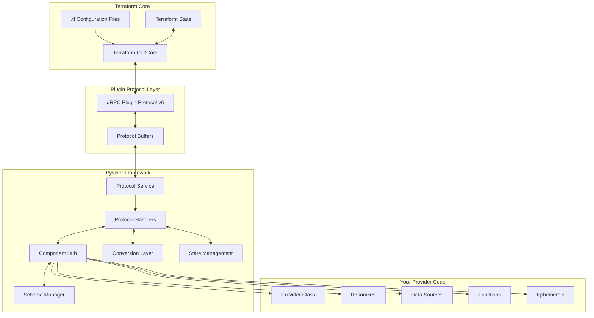
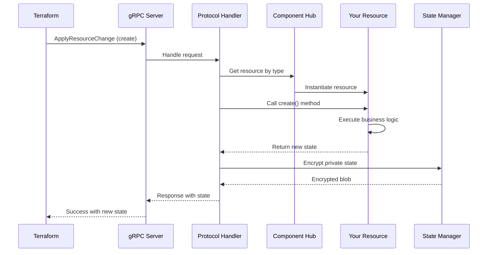
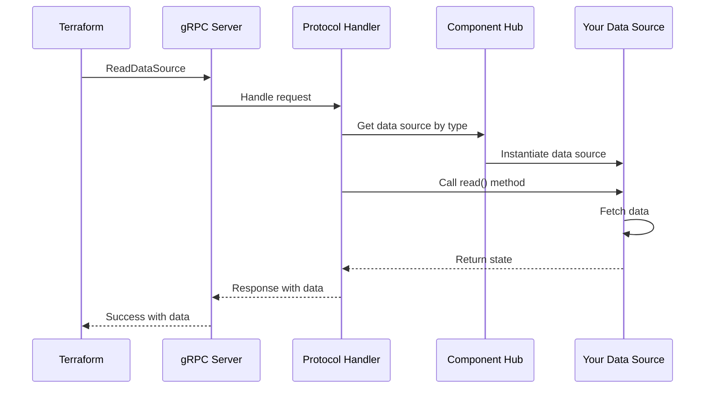
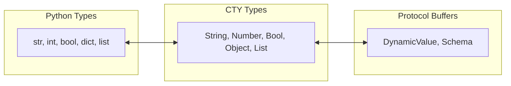
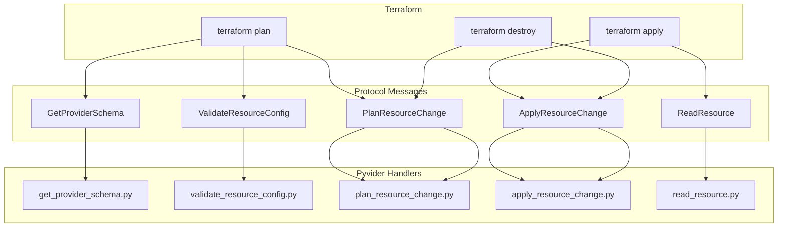
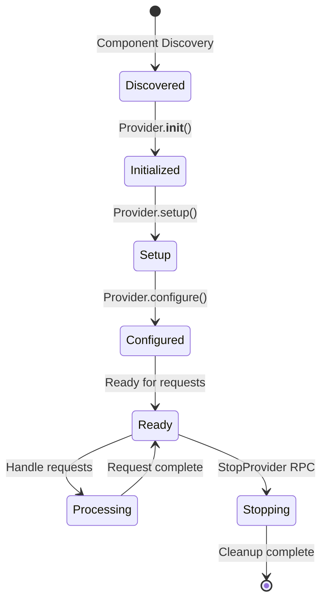
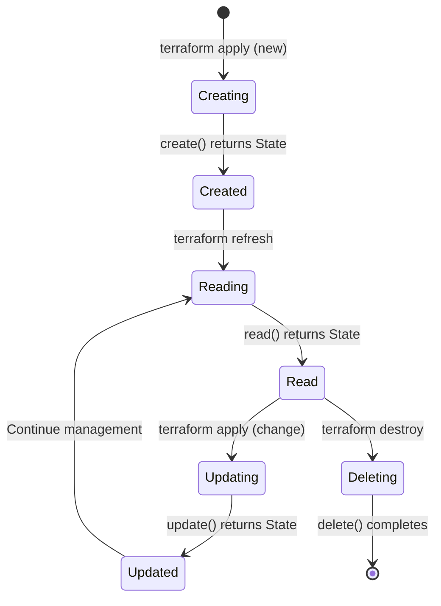

# 🏛️ Architecture Overview

Pyvider implements a sophisticated, layered architecture that seamlessly bridges Python code with Terraform's Plugin Protocol v6. This document provides a comprehensive understanding of how Pyvider transforms your Python classes into fully functional Terraform providers.

## 📊 High-Level Architecture



## 🔄 Request Flow

Understanding how a request flows through Pyvider is crucial for debugging and optimization:

### 1. Resource Creation Flow



### 2. Data Source Read Flow



## 🧩 Core Components

### 1. Component Hub (`pyvider.hub`)

The Component Hub is the central registry that manages all provider components:

```python
# Internal structure
class ComponentHub:
    providers: dict[str, type[BaseProvider]]
    resources: dict[str, type[BaseResource]]
    data_sources: dict[str, type[BaseDataSource]]
    functions: dict[str, type[BaseFunction]]
    ephemerals: dict[str, type[BaseEphemeral]]
    list_resources: dict[str, type[BaseListResource]]
    state_stores: dict[str, type[BaseStateStore]]
    actions: dict[str, type[BaseAction]]
```

**Responsibilities:**
- Automatic component discovery via decorators
- Type validation and registration
- Dependency injection for capabilities
- Component lifecycle management

### 2. Protocol Service (`pyvider.protocols.service`)

The Protocol Service implements the Terraform Plugin Protocol v6 gRPC service:

```python
class TerraformProviderServicer:
    async def GetProviderSchema(...)
    async def ValidateProviderConfig(...)
    async def ConfigureProvider(...)
    async def ValidateResourceConfig(...)
    async def PlanResourceChange(...)
    async def ApplyResourceChange(...)
    async def ReadResource(...)
    async def ImportResourceState(...)
    # ... and more
```

**Key Features:**
- Terraform Plugin Protocol v6.11 implementation
- Async/await support throughout
- Automatic error handling and diagnostics
- Request/response logging for debugging

### 3. Schema System (`pyvider.schema`)

The Schema System provides type-safe data modeling:

```python
from pyvider.schema import s_resource, a_str, a_map, a_num

@attrs.define
class ResourceConfig:
    """Configuration attrs class"""
    name: str
    tags: dict[str, str]
    size: int

@register_resource("example")
class ExampleResource(BaseResource):
    config_class = ResourceConfig

    @classmethod
    def get_schema(cls):
        """Schema definition using factory functions"""
        return s_resource({
            "name": a_str(required=True, description="Resource name"),
            "tags": a_map(a_str(), default={}, description="Resource tags"),
            "size": a_num(
                validators=[lambda x: 1 <= x <= 100 or "Must be 1-100"],
                description="Resource size"
            ),
        })
```

**Features:**
- Automatic schema generation from Python types
- Built-in validators and constraints
- Computed and sensitive attribute support
- Nested blocks and complex types

### 4. Conversion Layer (`pyvider.conversion`)

Handles bidirectional conversion between Python and Terraform types:



**Conversion Examples:**
- Python `dict` ↔ CTY `Object` ↔ Protocol Buffer `DynamicValue`
- Python `list[str]` ↔ CTY `List(String)` ↔ Protocol Buffer `DynamicValue`
- Python `@attrs.define` class ↔ CTY `Object` with schema

### 5. State Management (`pyvider.resources.private_state`)

Manages resource state with encryption for sensitive data:

```python
class PrivateState:
    """Encrypted storage for sensitive provider data"""
    
    @classmethod
    def encrypt(cls, data: dict) -> bytes:
        # AES-256 encryption with key derivation
        
    @classmethod
    def decrypt(cls, encrypted: bytes) -> dict:
        # Secure decryption with validation
```

**Security Features:**
- AES-256-GCM encryption
- Key derivation with PBKDF2
- Automatic key rotation support
- Tamper detection

## 🔌 Protocol Implementation

### Terraform Plugin Protocol v6

Pyvider implements the Terraform Plugin Protocol v6 specification, including the v6.11 state-store,
list-resource, and action RPCs. Each of those dispatches to a provider-defined component rather than
returning a generic response, and state is durable by default:

### Client Capabilities

Terraform 1.13+ introduced several capability flags in `ClientCapabilities` that inform the provider of what the CLI supports. Pyvider handles these as follows:

- **`deferral_allowed`**: Honored. When true, providers may raise a `Deferral` exception to defer the request; when false, raising a deferral results in an error diagnostic.
- **`write_only_attributes_allowed`**: Deliberately ignored. Pyvider unconditionally nullifies `write_only` attributes on outbound state responses. This is the safest default because old Terraform versions that do not support this capability would otherwise store the write-only (secret) value in plain text in the state file.
- **`store_planned_private`**: Deliberately ignored. Pyvider always emits private state regardless of client support. Unsupported clients will simply drop it, and providers must remain robust to its absence during `ApplyResourceChange`.
- **`computed_blocks_allowed`**: Deliberately ignored. The provider schema is statically defined upfront and cannot conditionally adapt its structure in `PlanResourceChange` based on a capability flag. Unsupported clients will error during schema validation.

#### Supported RPCs

| RPC Method | Purpose | Pyvider Support |
|------------|---------|-----------------|
| `GetProviderSchema` | Returns provider schema | ✅ Full |
| `ValidateProviderConfig` | Validates provider config | ✅ Full |
| `ConfigureProvider` | Configures provider instance | ✅ Full |
| `ValidateResourceConfig` | Validates resource config | ✅ Full |
| `ValidateDataResourceConfig` | Validates data source config | ✅ Full |
| `UpgradeResourceState` | Migrates resource state | ✅ Full |
| `ReadResource` | Refreshes resource state | ✅ Full |
| `PlanResourceChange` | Plans resource changes | ✅ Full |
| `ApplyResourceChange` | Applies resource changes | ✅ Full |
| `ImportResourceState` | Imports existing resources | ✅ Full |
| `MoveResourceState` | Moves resources | ✅ Full |
| `ReadDataSource` | Reads data source | ✅ Full |
| `GetFunctions` | Returns function definitions | ✅ Full |
| `CallFunction` | Executes functions | ✅ Full |
| `GenerateResourceConfig` | Derives a valid config from existing state | ✅ Full — calls `BaseResource.generate_config` |
| `ValidateListResourceConfig` | Validates a list block | ✅ Full — calls `BaseListResource.validate` |
| `ValidateEphemeralResourceConfig` | Validates ephemeral config | ✅ Full |
| `OpenEphemeralResource` | Opens ephemeral resource | ✅ Full |
| `RenewEphemeralResource` | Renews ephemeral resource | ✅ Full |
| `CloseEphemeralResource` | Closes ephemeral resource | ✅ Full |
| `ValidateStateStoreConfig` | Validates state store config | ✅ Full — calls `BaseStateStore.validate` |
| `ConfigureStateStore` | Configures a state store backend | ✅ Full — calls `BaseStateStore.configure` |
| `ListResource` | Streams listable resources | ✅ Full — streams `BaseListResource.list` |
| `ReadStateBytes` | Reads state store payload chunks | ✅ Full — durable backend |
| `WriteStateBytes` | Writes state store payload chunks | ✅ Full — durable, atomic writes |
| `LockState` | Acquires a state lock | ✅ Full — cross-process, lease-aware |
| `UnlockState` | Releases a state lock | ✅ Full — cross-process, lease-aware |
| `GetStates` | Enumerates provider states | ✅ Full — durable backend |
| `DeleteState` | Deletes remote state data | ✅ Full — durable backend |
| `PlanAction` | Plans action execution | ✅ Full — calls `BaseAction.plan` |
| `InvokeAction` | Invokes actions | ✅ Full — streams `BaseAction.invoke` |
| `ValidateActionConfig` | Validates action config | ✅ Full — calls `BaseAction.validate` |
| `StopProvider` | Graceful shutdown | ✅ Full |

An RPC whose type name is not registered returns an error diagnostic naming the type and listing what
is registered, rather than a silent success.

### v6.11 Extension Points

The v6.11 RPCs are backed by three component types, each registered with a decorator and discovered the
same way resources are.

#### State stores (`pyvider.state_stores`)

A state store backs Terraform's pluggable remote-state RPCs. `BaseStateStore` defines the contract;
two backends ship with the framework:

| Backend | Durable | Use |
|---------|---------|-----|
| `FileSystemStateStore` | Yes | Production. Payloads are written to a temp file, fsynced, then `os.replace`-d over the target, so a reader sees the whole old value or the whole new one. |
| `InMemoryStateStore` | No | Unit tests and single-process local development. State lives in the process heap and is lost on restart. |

Locks are leases, not flags. A lock record is read and rewritten inside a POSIX record lock, which makes
"check whether it is locked, then claim it" a single atomic step across processes; the lease carries an
absolute expiry, so a provider that dies holding a lock does not wedge the state permanently. A lock
request that collides with a live lease returns an error diagnostic rather than stealing it.

##### Windows caveats

The filesystem backend runs on Windows, but three POSIX guarantees weaken there. They are listed
because each one silently degrades rather than failing loudly:

| Guarantee | POSIX | Windows |
|---|---|---|
| Mutex released when the holder dies | Kernel-owned record lock, automatic | Sentinel file; reclaimed only after a staleness timeout |
| State files readable only by their owner | `chmod 0600` enforced | `chmod` toggles the read-only bit only — **it cannot restrict other users** |
| Directory entry fsynced after rename | `fsync` on the directory fd | Directories cannot be opened as file descriptors; the step is skipped |

`os.replace` also differs: on Windows it fails if another process currently has the target file open,
so a concurrent reader can make a write fail rather than being served the previous version.

Treat a state directory on a multi-user Windows host as **not** access-controlled by this backend. Use
filesystem ACLs, or a backend whose storage enforces its own access control.

Backend selection for a store type, in order:

1. a backend registered for that type name with `@register_state_store`
2. `PYVIDER_STATE_STORE_BACKEND` (`memory` or `filesystem`)
3. `filesystem` when `PYVIDER_STATE_STORE_PATH` is set — naming a directory is read as intent to persist
4. `memory`

`PYVIDER_STATE_STORE_LOCK_TTL` overrides the lease duration in seconds.

```python
from pyvider.state_stores import BaseStateStore, register_state_store

@register_state_store("acme_s3")
class S3StateStore(BaseStateStore):
    async def read_state(self, type_name: str, state_id: str) -> bytes | None: ...
    async def write_state(self, type_name: str, state_id: str, payload: bytes) -> None: ...
    # ... plus delete_state, list_states, lock_state, unlock_state, get_lock
```

#### List resources (`pyvider.list_resources`)

A list resource answers `ListResource`: given a filter configuration, stream the resources that exist
remotely. Results are keyed by resource identity, which is how Terraform ties a listed instance back to
a managed resource. Setting `resource_type` borrows that resource's identity and state schemas, so the
common case restates neither.

**A list resource is registered under the managed resource's own name.** Terraform looks its results up
against the managed resource type with the same name, and refuses to list at all when there is no such
type: `Identity schema not found for resource type <name>; this is a bug in the provider`
(`internal/plugin6/grpc_provider.go:1341-1345`). A list resource is another way to find instances of a
managed resource, not a type of its own, so a name like `acme_widget_list` cannot work. The framework
warns at schema time when a list resource has no managed counterpart.

```python
from pyvider.list_resources import BaseListResource, ListResult, register_list_resource

@register_list_resource("acme_widget", resource_type="acme_widget")
class WidgetList(BaseListResource):
    config_class = WidgetListConfig

    @classmethod
    def get_schema(cls): ...

    async def list(self, ctx):
        for widget in await fetch(ctx.config):
            yield ListResult(identity={"id": widget.id}, display_name=widget.name)
```

Results are forwarded one at a time as they are yielded, and the stream stops at `ctx.limit`, so an
implementation that yields lazily never does work Terraform will discard.

#### Actions (`pyvider.actions`)

An action is a provider-defined operation Terraform invokes on its own, outside any resource lifecycle.
It is validated, then planned, then invoked as a stream of progress events.

```python
from pyvider.actions import ActionPlan, ActionProgress, BaseAction, register_action

@register_action("acme_reboot")
class Reboot(BaseAction):
    config_class = RebootConfig

    @classmethod
    def get_schema(cls): ...

    async def plan(self, ctx) -> ActionPlan:
        return ActionPlan()

    async def invoke(self, ctx):
        yield ActionProgress(message="draining")
        await drain(ctx.config.target)
        yield ActionProgress(message="rebooting")
```

`plan()` can return warnings, or defer with a `DeferralReason` when a prerequisite is not yet known — a
deferral is only forwarded when the client set `deferral_allowed`. Every `InvokeAction` ends with
exactly one completed event, including on failure, so a failed action cannot leave Terraform waiting.

### Message Flow



## 🎯 Component Discovery

Pyvider uses a sophisticated discovery mechanism to find and register components:

### Discovery Process

1. **Entry Point Scanning**: Looks for `pyvider.components` entry points
2. **Package Traversal**: Recursively scans packages for decorated classes
3. **Decorator Detection**: Identifies classes with registration decorators
4. **Validation**: Ensures components meet interface requirements
5. **Registration**: Adds valid components to the hub

### Registration Flow

```python
# Your code
@register_resource("my_resource")
class MyResource(BaseResource):
    pass

# Discovery process
1. Scanner finds @register_resource decorator
2. Validates MyResource extends BaseResource
3. Checks for required methods (create, read, update, delete)
4. Registers in hub.resources["my_resource"] = MyResource
5. Generates Terraform schema from class definition
```

## 🔧 Lifecycle Hooks

Pyvider provides lifecycle hooks for advanced customization:

### Provider Lifecycle



### Resource Lifecycle



## ⚡ Performance Optimizations

### 1. Async Everything

All I/O operations use async/await for maximum concurrency:

```python
async def _create_apply(self, ctx: ResourceContext) -> tuple[State | None, None]:
    # Parallel API calls
    results = await asyncio.gather(
        self.create_network(),
        self.allocate_storage(),
        self.configure_security()
    )
    return State(...), None
```

### 2. Connection Pooling

gRPC connections are pooled and reused:

```python
# Automatic connection management
channel_pool = grpc.aio.insecure_channel(
    target='localhost:50051',
    options=[
        ('grpc.max_connection_idle_ms', 30000),
        ('grpc.keepalive_time_ms', 10000),
    ]
)
```

### 3. Schema Caching

Schemas are computed once and cached:

```python
@cached_property
def schema(self) -> PvsSchema:
    return self._generate_schema()
```

### 4. Lazy Loading

Components are loaded only when needed:

```python
def get_resource(self, name: str) -> type[BaseResource]:
    if name not in self._loaded:
        self._loaded[name] = self._load_resource(name)
    return self._loaded[name]
```

## 🔍 Debugging Architecture

### Debug Logging

Enable comprehensive debug logging:

```bash
export PYVIDER_LOG_LEVEL=DEBUG
export FOUNDATION_LOG_LEVEL=DEBUG
```

### Request Tracing

Every request includes trace IDs for correlation:

```
[2024-01-15 10:23:45] [INFO] [trace_id=abc123] ApplyResourceChange started
[2024-01-15 10:23:45] [DEBUG] [trace_id=abc123] Resource type: my_resource
[2024-01-15 10:23:46] [INFO] [trace_id=abc123] ApplyResourceChange completed
```

### Performance Profiling

Built-in profiling for optimization:

```python
from pyvider.resources.context import ResourceContext

with timed_block(logger, "resource_creation"):
    state, _ = await resource._create_apply(ResourceContext(config=config))
# Logs: [⏱️] resource_creation duration_ms=234.56
```

## 🛡️ Security Architecture

### 1. Input Validation

All inputs are validated before processing:

```python
from pyvider.schema import s_provider, a_str

@attrs.define
class ProviderConfig:
    """Provider configuration attrs class"""
    api_key: str

@register_provider("example")
class ExampleProvider(BaseProvider):
    @classmethod
    def _build_schema(cls):
        """Schema with validators"""
        return s_provider({
            "api_key": a_str(
                required=True,
                validators=[
                    lambda x: 32 <= len(x) <= 64 or "Must be 32-64 chars",
                    lambda x: x.isalnum() or "Must be alphanumeric"
                ]
            )
        })
```

### 2. Secret Management

Sensitive data never logged or exposed:

```python
from pyvider.schema import s_provider, a_str

@classmethod
def _build_schema(cls):
    return s_provider({
        "password": a_str(
            required=True,
            sensitive=True,  # Never logged or shown in output
            description="Database password"
        )
    })
```

### 3. Secure Communication

gRPC with TLS support:

```python
credentials = grpc.ssl_channel_credentials()
channel = grpc.aio.secure_channel('localhost:50051', credentials)
```

## 🎓 Architecture Best Practices

### 1. Separation of Concerns

- **Provider**: Configuration and authentication
- **Resources**: CRUD operations for infrastructure
- **Data Sources**: Read-only data fetching
- **Functions**: Pure transformations
- **Capabilities**: Reusable functionality

### 2. Error Handling

```python
async def _create_apply(self, ctx: ResourceContext) -> tuple[State | None, None]:
    try:
        result = await self.api_call()
    except ApiError as e:
        raise ResourceError(f"Failed to create: {e}")
    return State(...), None
```

### 3. Resource Design

- Keep resources focused on a single concern
- Use composition via capabilities for shared functionality
- Implement proper error handling and rollback
- Always validate inputs

### 4. State Management

- Store only essential data in state
- Use private state for sensitive information
- Implement proper read() to detect drift
- Handle missing resources gracefully

## ⚠️ Alpha Considerations

Pyvider's architecture is stable, but as a pre-release project:

Some APIs may change during the pre-release series.

- Internal APIs may change before 1.0
- Performance characteristics are still being optimized
- Some edge cases may not be fully handled

Report architectural issues or suggestions in [GitHub Discussions](https://github.com/provide-io/pyvider/discussions).

## 📚 Further Reading

- [Component Model](component-model.md) - Deep dive into component system
- [Schema System](schema-system.md) - Advanced schema features
- [Schema System](../schema/overview.md) - Schema documentation

---

<p align="center">
  Continue to <a href="component-model.md">Component Model →</a>
</p>
