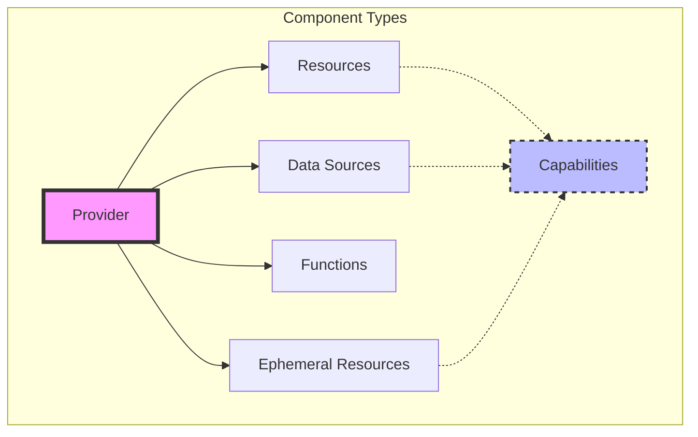
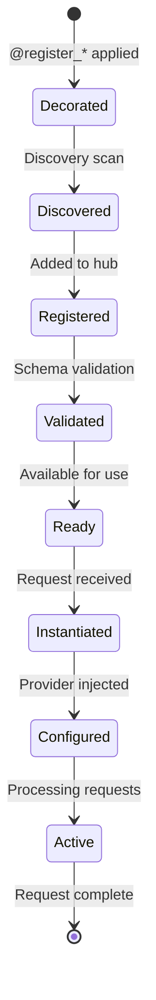

# 🧩 Component Model

Pyvider's component model provides a powerful, decorator-based system for building Terraform providers. This document explores the architecture of how components are defined, discovered, registered, and managed.

## 📊 Component Hierarchy



## 🎯 Component Types

### 1. Provider Component

**Purpose**: Root component that configures authentication and shared settings

**Key Characteristics:**
- **Singleton**: Only one provider instance per Terraform configuration
- **Configuration Hub**: Stores shared configuration for all resources
- **Authentication**: Manages API credentials and client initialization
- **Metadata**: Defines provider name, version, and capabilities

**Registration**: `@register_provider("name")`

**See**: [Creating Providers Guide](../guides/building-components/creating-providers.md) for complete examples

---

### 2. Resource Component

**Purpose**: Manages infrastructure with full CRUD lifecycle

**Lifecycle Methods:**
- `_create_apply()` - Creates new infrastructure
- `read()` - Refreshes current state
- `_update_apply()` - Modifies existing infrastructure
- `_delete_apply()` - Removes infrastructure

**Key Features:**
- State tracking via `State` class
- Private state for sensitive data
- Configuration validation
- Drift detection

**Registration**: `@register_resource("name")`

**See**: [Creating Resources Guide](../guides/building-components/creating-resources.md) for complete examples

---

### 3. Data Source Component

**Purpose**: Read-only access to existing infrastructure

**Lifecycle Methods:**
- `read()` - Fetches data from external systems

**Key Features:**
- No state modification
- Query-based data retrieval
- Computed-only attributes
- Caching support

**Registration**: `@register_data_source("name")`

**See**: [Creating Data Sources Guide](../guides/building-components/creating-data-sources.md) for complete examples

---

### 4. Function Component

**Purpose**: Pure, callable transformations

**Lifecycle Methods:**
- `call()` - Executes transformation logic

**Key Features:**
- Stateless operations
- Input/output type safety
- No side effects
- Terraform-native functions

**Registration**: `@register_function(name="name")`

**See**: [Creating Functions Guide](../guides/building-components/creating-functions.md) for complete examples

---

### 5. Ephemeral Resource Component

**Purpose**: Short-lived connections or sessions

**Lifecycle Methods:**
- `open()` - Creates ephemeral resource
- `renew()` - Extends lifetime
- `close()` - Destroys resource

**Key Features:**
- Not persisted in state
- Automatic lifecycle management
- Time-based renewal
- Perfect for credentials, connections

**Registration**: `@register_ephemeral_resource("name")`

**See**: [Ephemeral Resources API](../api/ephemerals.md) for complete examples

---

## 🔍 Component Discovery

### Discovery Mechanism

Pyvider uses a multi-stage discovery process:

1. **Entry Point Scanning**: Looks for `pyvider.components` entry points in installed packages
2. **Package Traversal**: Recursively scans packages for decorated classes
3. **Decorator Detection**: Identifies classes with `@register_*` decorators
4. **Validation**: Ensures components meet interface requirements
5. **Registration**: Adds valid components to the component hub

### Entry Points

Components can be discovered through Python entry points in `pyproject.toml`:

```toml
[project.entry-points."pyvider.components"]
mycloud = "mycloud_provider.components"
```

### Manual Registration

For testing or dynamic scenarios:

```python
from pyvider.hub import hub

# Register manually
hub.register("resource", "custom_resource", CustomResource)
```

## 🎨 Decorator System

### Registration Decorators

Each component type has its own registration decorator:

| Decorator | Component Type |
|-----------|---------------|
| `@register_provider("name")` | Provider |
| `@register_resource("name")` | Resource |
| `@register_data_source("name")` | Data Source |
| `@register_function(name="name")` | Function |
| `@register_ephemeral_resource("name")` | Ephemeral |
| `@register_capability("name")` | Capability |

### Decorator Metadata

Decorators attach metadata to classes for discovery:

```python
@register_resource("server")
class Server(BaseResource):
    pass

# Metadata attached:
# Server._is_registered_resource = True
# Server._registered_name = "server"
```

## 🔗 Component Relationships

### Provider Access

Resources and other components can access the provider instance via the component hub:

```python
async def _create_apply(self, ctx: ResourceContext):
    # Access provider instance from hub
    from pyvider.hub import hub
    provider = hub.get_component("singleton", "provider")

    # Use provider's client and configuration
    client = provider.api_client
    config = provider.provider_config
```

### Capability Composition

Components can use capabilities for cross-cutting concerns:

```python
@register_resource("server")
class Server(BaseResource):
    async def _create_apply(self, ctx: ResourceContext):
        # Access capabilities through context
        token = await ctx.capabilities.auth.get_token()
```

**See**: [Capabilities Overview](../capabilities/overview.md)

## 📋 Schema Generation

### Automatic Type Mapping

Pyvider automatically generates Terraform schemas from Python type annotations:

| Python Type | Terraform Type |
|-------------|----------------|
| `str` | `string` |
| `int`, `float` | `number` |
| `bool` | `bool` |
| `list[T]` | `list(T)` |
| `dict[str, T]` | `map(T)` |
| `set[T]` | `set(T)` |
| `@attrs.define` class | `object` |

### Schema Definition

Components define schemas using factory functions:

```python
@classmethod
def get_schema(cls) -> PvsSchema:
    return s_resource({
        "name": a_str(required=True, description="..."),
        "port": a_num(default=8080, description="..."),
        "id": a_str(computed=True, description="..."),
    })
```

**See**: [Schema System](schema-system.md) and [Schema Documentation](../schema/overview.md)

## 🔄 Component Lifecycle

### Initialization Flow



### Invocation Pattern

```python
# 1. Framework looks up component
resource_cls = hub.get_component("resource", "server")

# 2. Instantiates the resource
resource = resource_cls()

# 3. Creates context
ctx = ResourceContext(config=..., state=...)

# 4. Calls lifecycle methods
state, private = await resource._create_apply(ctx)
```

## 🛡️ Validation

### Component Validation

During registration, components are validated for:

- Correct base class inheritance
- Required methods present
- Schema class definitions
- Type signature correctness

### Schema Validation

Runtime validation ensures:

- Configuration matches schema
- Required fields present
- Type constraints satisfied
- Custom validators pass

## 🎯 Best Practices

### 1. Component Design

**Do:**
- Focus on single responsibility
- Use descriptive, Terraform-friendly names
- Implement comprehensive error handling
- Document all attributes and methods

**Don't:**
- Mix multiple concerns in one component
- Use generic names
- Ignore validation
- Skip documentation

### 2. Naming Conventions

- Resources: Nouns describing infrastructure (`server`, `database`, `network`)
- Data Sources: Plural or descriptive (`images`, `availability_zones`, `account_info`)
- Functions: Action verbs (`encode`, `parse`, `transform`)

### 3. State Management

- Store only essential state data
- Use private state for sensitive information
- Implement proper `read()` for drift detection
- Handle missing resources gracefully

### 4. Error Handling

- Provide clear, actionable error messages
- Use appropriate exception types
- Include relevant context in errors
- Log errors with structured data

## 📚 Advanced Topics

### Dynamic Component Registration

Create components at runtime:

```python
def create_dynamic_resource(table_name: str):
    @register_resource(f"dynamodb_{table_name}")
    class DynamicTable(BaseResource):
        pass
    return DynamicTable
```

### Component Inheritance

Share functionality across components:

```python
class BaseCloudResource(BaseResource):
    """Shared functionality for cloud resources."""
    async def apply_tags(self, resource_id, tags):
        pass

@register_resource("server")
class Server(BaseCloudResource):
    # Inherits tagging functionality
    pass
```

**See**: [Advanced Patterns Guide](../guides/advanced/advanced-patterns.md)

## 🔗 Related Documentation

- **[Architecture Overview](architecture.md)** - System architecture and data flow
- **[Schema System](schema-system.md)** - Type-safe data modeling
- **[Creating Providers](../guides/building-components/creating-providers.md)** - Step-by-step provider guide
- **[Creating Resources](../guides/building-components/creating-resources.md)** - Resource implementation guide
- **[Creating Data Sources](../guides/building-components/creating-data-sources.md)** - Data source patterns
- **[Creating Functions](../guides/building-components/creating-functions.md)** - Function development
- **[Best Practices](../guides/production/best-practices.md)** - Production-focused patterns

---

<p align="center">
  Continue to <a href="schema-system.md">Schema System →</a>
</p>
